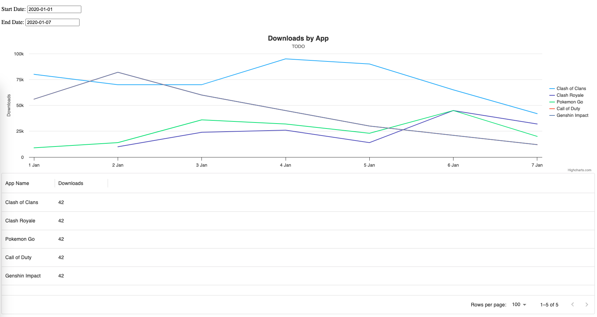
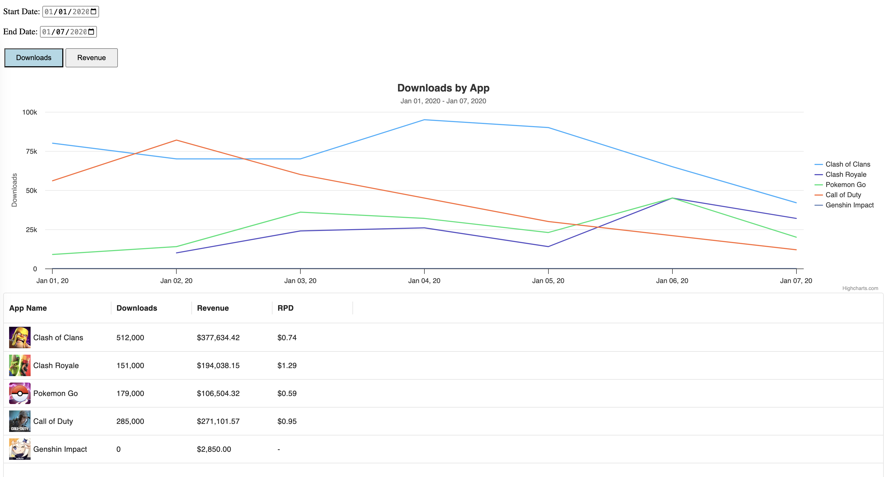

# Sensor Tower Front End Assignment

Thank you for your interest in Sensor Tower! We appreciate your time and effort in completing this take-home assignment. We understand that your time is valuable, and we estimate that this assignment should not take more than 3-4 hours to complete. We look forward to reviewing your work and getting to know you better. If you have any questions or need further clarification, please don't hesitate to reach out. Good luck!

## Quick Start

1. `npm install`
2. `npm start` to start the server
3. Visit `localhost:3000` in your browser

Once you have completed the assignment, please send us an email so that we can evaluate your work. Thank you!

## Quick Overview

The page, from top to bottom, consists of:

- Controls to filter the data
- A chart with downloads or revenue data
- A table of the app and sales data

There is a single endpoint, "data.json" that returns sales data. The data looks like so:

```json
[
  {
    "id": 1,
    "name": "Clash of Clans",
    "icon": "image_url",
    "data": [
      ["2020-01-01", 80000, 9808000],
      ["2020-01-02", 70000, 9790000],
      ["2020-01-03", 70000, 9000000],
      ["2020-01-04", 95000, 3500000],
      ["2020-01-05", 90000, 2000000],
      ["2020-01-06", 65000, 1241201],
      ["2020-01-07", 42000, 2424241]
    ],
  }, ...
]
```

Each element in the "data" array is a tuple of the date, downloads, and revenue in cents.

The page should look like this before you do any work:



After you are done with the tasks below, the page can look like this:



## Tasks

Here are the tasks you should complete:

### Controls

- [ ] Add Downloads and Revenue buttons (aka "measures")
  - [ ] They should be roughly formatted according to the screenshots
  - [ ] The selected button should have a light blue background

### Chart

- [ ] The title should say...
  - [ ] "Downloads by App" when the downloads button is selected
  - [ ] "Revenue by App" when the revenue button is selected
- [ ] The chart should show revenue data when the Revenue button is selected
- [ ] The chart should only plot points within (and including) the start and end date inputs
  - [ ] It should automatically update when the start or end date inputs change
- [ ] The chart subtitle should have the date range:
  - e.g. "Jan 01, 2020 - Jan 07, 2020"
  - [ ] It should automatically update when the start or end date inputs change
- [ ] The chart's Y Axis should say "Downloads" or "Revenue ($)" depending on the selected measures
- [ ] The chart's X Axis should have formatted dates:
  - e.g. "Jan 01, 20'", "Jan 07, 20'", etc

### Table

- [ ] Make the header row text bold
- [ ] Fix the calculation for the total downloads cells
- [ ] The download cells should be formatted with thousands commas
  - E.G. 80000 downloads should be "80,000"
- [ ] Add a column for Revenue
  - [ ] The table header should say "Revenue"
  - [ ] The revenue cells should have the revenue, formatted with a dollar sign and commas. EG: "$140,043.51"
- [ ] Add a column for "Revenue per Download"
  - [ ] The table header should say "RPD"
  - [ ] The RPD cells should have the revenue divided by downloads. If the value is invalid, the cell should say "-".
  - [ ] The RPD cells should be formatted like the Revenue column
- [ ] The table should only use data within (and including) the start and end date inputs to calculate the total downloads/revenue/RPD.

### Bonus

- [ ] Add a loading state for the chart and table
- [ ] In the table, add each app's icon next to app name in the `App Name` column
- [ ] Address any inefficiencies in the code

## Tips:

- We use multiple libraries: Highcharts, MUI's Data Grid, and Dayjs. You can read their documentation/API here:
  - Highcharts - https://api.highcharts.com/highcharts/
  - Data Grid - https://mui.com/x/react-data-grid/
  - Dayjs - https://day.js.org/en/
